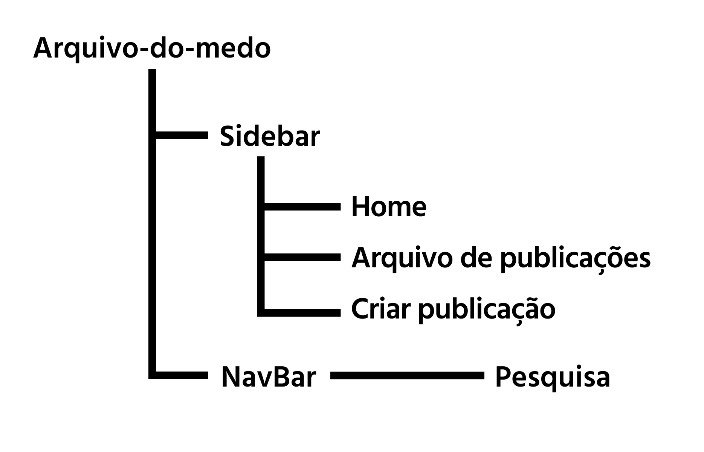
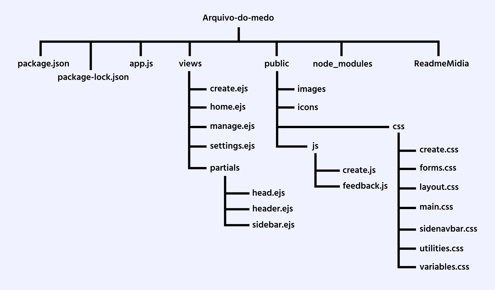
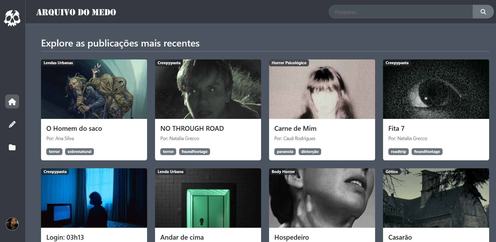
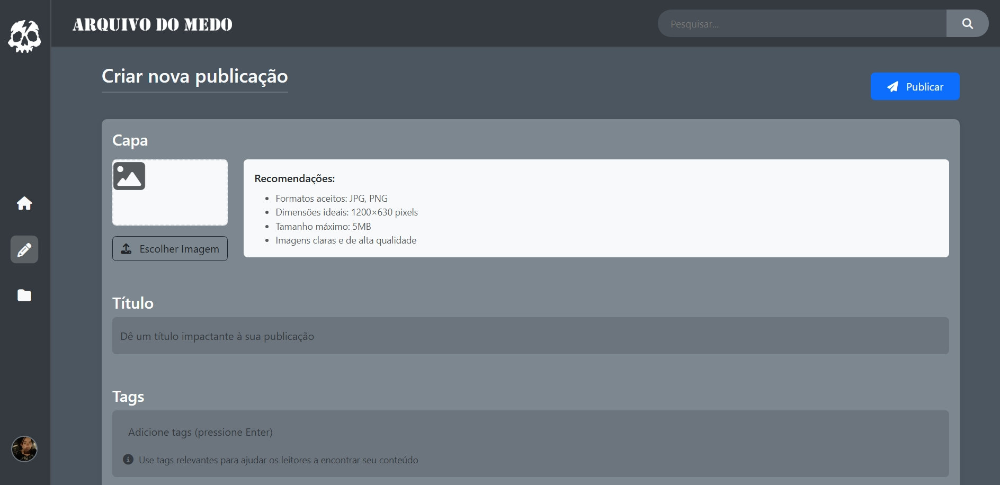
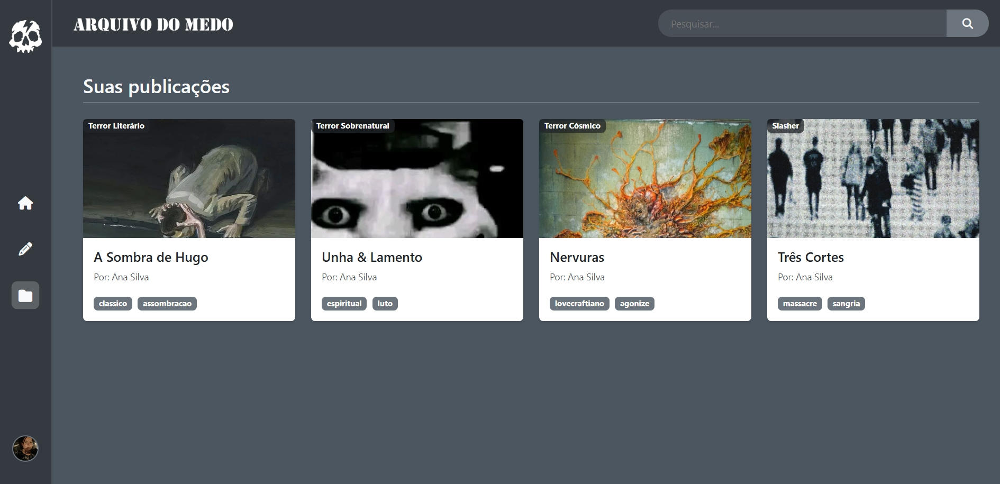

---

## 🕯️ Sobre o Projeto

**Arquivo do Medo** é um portal sombrio onde você pode:

- ✍️ Escrever e publicar seus contos de terror originais  
- 📂 Compartilhar creepypastas arrepiantes  
- 💀 Discutir histórias já existentes  
- 🔍 Explorar os relatos mais perturbadores da comunidade  

> *"Abra este arquivo por sua conta e risco... alguns contos nunca deveriam ser lidos."*

---

## 🧟 Funcionalidades Principais

| Seção         | Descrição                                        |
|---------------|--------------------------------------------------|
| 🏠 Home        | Página inicial com histórias em destaque         |
| 📁 Arquivos    | Todas as suas publicações na comunidade          |
| ✒️ Publicar    | Área para criar novas histórias de terror        |
| 👤 Usuário     | Perfil pessoal (em desenvolvimento)              |

---

## Rotas




📁 arquivo-do-medo/
├── 📁 public/
│   ├── 📁 css/
│   │   ├── 📄 forms.css
│   │   ├── 📄 create.css
│   │   ├── 📄 layout.css
│   │   ├── 📄 main.css
│   │   ├── 📄 history.css
│   │   ├── 📄 sidenavbar.css
│   │   ├── 📄 utilities.css
│   │   └── 📄 variables.css
│   ├── 📁 icons/
│   │   └── 📄 IconArq.png
│   ├── 📁 images/
│   │   └── 📁 covers
│   └── 📁 js/
│       ├── 📄 create.js
│       └── 📄 feedback.js
│
├── 📁 views/
│   ├── 📁 partials/
│   │   ├── 📄 head.ejs
│   │   ├── 📄 header.ejs
│   │   └── 📄 sidebar.ejs
│   ├── 📄 autorcard.ejs
│   ├── 📄 card.ejs
│   ├── 📄 create.ejs
│   ├── 📄 edicao.ejs
│   ├── 📄 home.ejs
│   ├── 📄 login.ejs
│   ├── 📄 manage.ejs
│   ├── 📄 cardedit.ejs
│   ├── 📄 register.ejs
│   └── 📄 settings.ejs
├── 📄 app.js
├── 📄 database.js
├── 📄 package-lock.json
└── 📄 package.json

---

## 🎭 Diferenciais

- 🌑 Interface imersiva com tema de terror  
- 🔖 Sistema de tags para categorias de horror  
- 🚫 Avisos de conteúdo sensível  

---

## 🖼️ Informações

### 🎥 Vídeo Tour pelo Site


https://github.com/user-attachments/assets/b1d7caac-2d53-4c6c-9a6c-3f3d528adf8f


### 🖼️ Design





---

## 💀 Como Executar Localmente

### ✅ Pré-requisitos

- Node.js v16+  

### 📂 Clonar o repositório

- Arquivo rodando em [localhost](http://localhost:3000/)

```bash
git clone https://github.com/anabcarvalho30/PwebII/arq
cd PwebII
cd arq
npm init
node app.js

