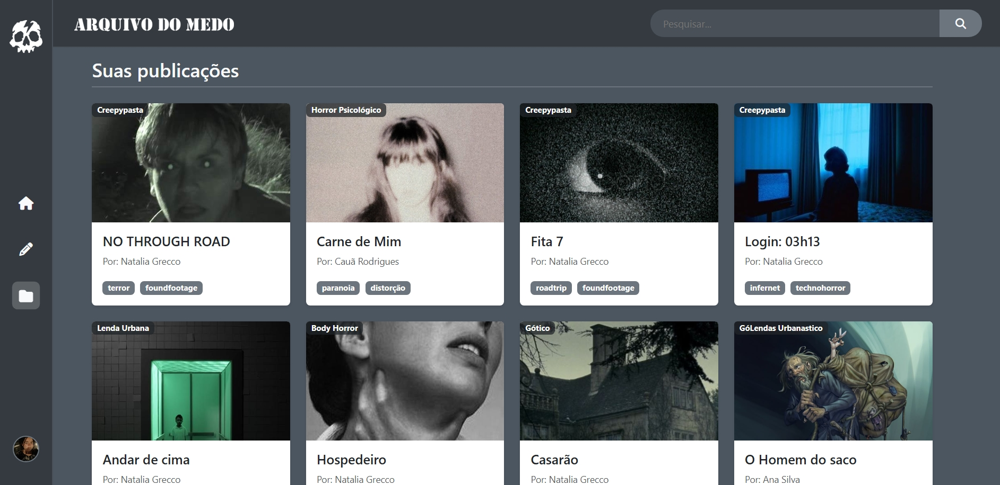
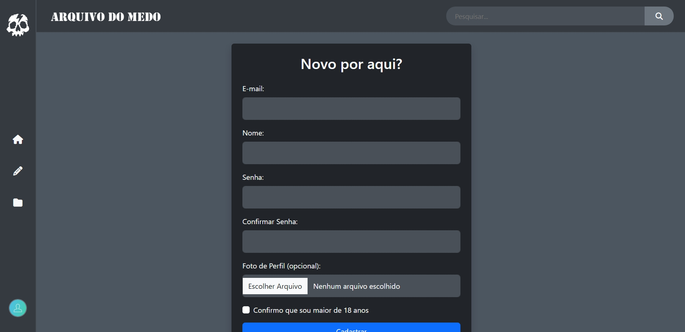
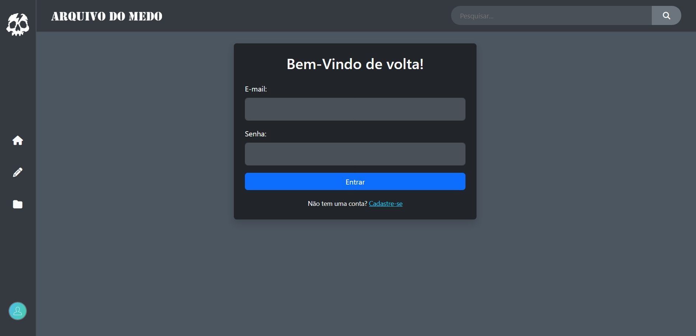
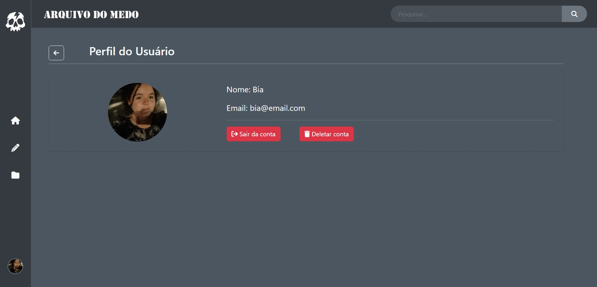
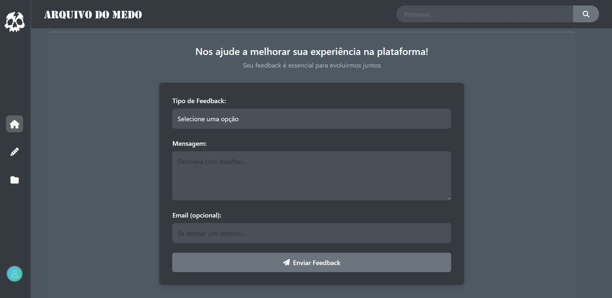
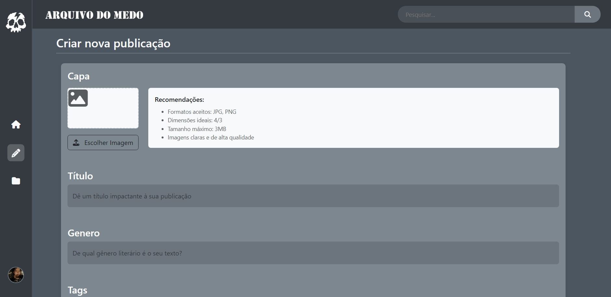
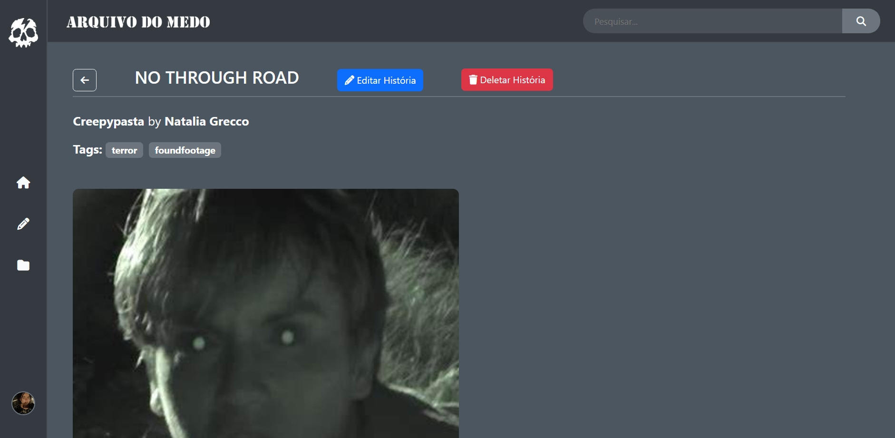
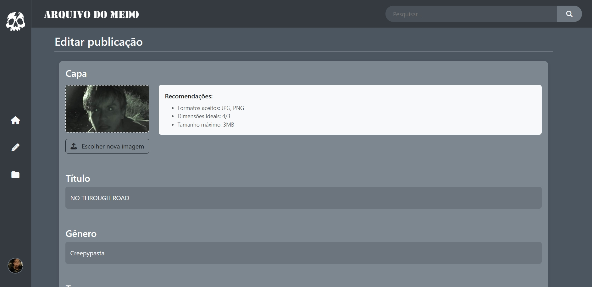

---

## Sobre o Projeto

**Arquivo do Medo** Portal de publicações de histórias:

---

## 🧟 Funcionalidades Principais

| Seção         | Descrição                                        |
|---------------|--------------------------------------------------|
| 🏠 Home       | Página inicial com histórias em destaque         |
| 📁 Arquivos   | Todas as suas publicações na comunidade          |
| ✏️ Publicação | Página de publicação qualquer                    |  
| ✏️ Publicação User | Aba da publicação do usuário                |
| ✒️ Edição     | Semelhante a 'Publicar' - Editar / Deletar       |
| ✒️ Publicar   | Área para criar novas histórias de terror        |
| 👤 Usuário    | Perfil pessoal                                   |
| 👤 Login      | Formulário de Login                              |
| 👤 Register   | Formulário de Registro                           |

## Funções a serem implementadas e melhorias:

- User editar UserInfo;
- Deletar imagens do banco de dados após deletar usuário ou publicação;
- Erro nas tags ao criar publicação;
- Erro na textarea onde se encontra o text;
- Adicionar funcionalidades diversas para dinamismo dos usuários - Seguir; Bloquear; Favoritar histórias; Comentar.

---

## Informações

### Vídeo Tour pelo Site


https://github.com/user-attachments/assets/b1d7caac-2d53-4c6c-9a6c-3f3d528adf8f


### Design











---

## Como Executar Localmente

### ✅ Pré-requisitos

- Node.js v16+  

### 📂 Clonar o repositório

- Arquivo rodando em [localhost](http://localhost:3000/)

```bash
git clone https://github.com/anabcarvalho30/PwebII/arq
cd PwebII
cd arq
npm init
node app.js

